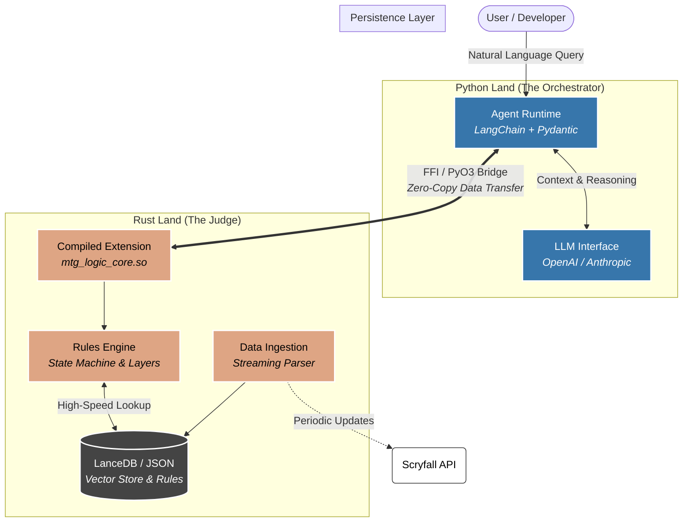

# Blind Eternities

**A Retrieval-Augmented Rules (RAG) Engine for Magic: The Gathering**

## Architecture

This project uses a hybrid **Python + Rust** architecture. Python handles the semantic reasoning (LLM), while a compiled Rust core enforces the strict game state and handles high-performance vector retrieval.



## Phase 1 - The Judge

Steps to verify (ensure .env vars are filled out):

* Test the rust backend:
  * cd rust_core
  * cargo test

* Compile the rust_core as a python library:
  * Ensure terminal is at project root
  * maturin develop

* Smoke test:
  * Ensure terminal is at project root
  * python -c "import mtg_logic_core; print(f'Bridge Operational: {mtg_logic_core.__name__}')"

* Run interactive python agent (run as a module (-m) to resolve relative imports correctly):
  * python -m python_agent.main
  * Enter the following prompt once the agent is ready for `User:` input:
    * I have an Urza, Lord High Artificer on the battlefield. I cast a second Urza, Lord High Artificer. What happens?

My first prompt response:

```txt
[DEBUG] 🛠️  The Agent is calling Rust for: Urza, Lord High Artificer
Agent: You cannot keep two Urza, Lord High Artificer on the battlefield.

What happens:
- You cast a second Urza. Both Urzas are on the battlefield, so state-based actions are checked.
- The Legend Rule applies: if a player controls two or more legendary permanents with the same name, that player sacrifices all but one of them.
- You choose which Urza to keep; the other Urza is put into its owner's graveyard immediately.

Result: You end up with only one Urza, Lord High Artificer, on the battlefield.

Citations:
- The Legend Rule: If a player controls two or more legendary permanents with the same name, that player sacrifices all but one of them. (CR reference: Legend Rule, commonly cited as 704.5 in the current Comprehensive Rules; exact numbering may vary by edition, but the rule is well-established as the Legend Rule.)

Note:
- Entering-the-battlefield triggers associated with the second Urza would be placed on the stack as part of the event of it entering; however, the legend-rule sacrifice occurs as a state-based action immediately after resolution, before priority. If you’d like, I can walk through the exact timing and any ETB triggers for this scenario.
```

This is a huge milestone. I have successfully built a Vertical Slice of a polyglot AI architecture.

Why this is a victory:
The Proof ([DEBUG]): That print statement confirms the LLM didn't just guess. It recognized the need for authority, formulated a JSON payload, crossed the FFI boundary into Rust, executed the compiled logic, and interpreted the structured result.

The Nuance: Notice the agent correctly identified that State-Based Actions (SBAs) happen before triggers go on the stack. The LLM handled the "Explanation" layer, while Rust provided the "Hard Truth" (the Legend Rule violation).

Phase 2: The "Librarian" (Vector Database)
Right now, the Rust engine is a brilliant judge, but it has amnesia. It only knows the cards explicitly passed to it in the JSON. To make this a real product, it needs instant access to the 27,000+ cards in the scryfall_oracle.json file that will be downloaded in the next milestone.

I need to implement Retrieval Augmented Generation (RAG) using LanceDB.

## Phase 2 - The Librarian

* Download and parse card data from Scryfall using the "ingest" rust script.
* Index the card data for optimized use in a vector database using the "index" rust script.
  
Steps to verify:

* Ensure terminal is in project root
* python ./test_core.py

## Phase 3 - The Concept of Time

* Implementing "Timing" rules. For example:
  * "Can I cast this Creature right now?" or "Can I play a Land during an opponent's turn?"

Steps to verify:

* Ensure terminal is in project root
* python ./test_judge_logic.py

## Phase 4 - The Cockpit

* Use Streamlit for a simple dashboard for card searches and Judge interactions.

Steps to verify:

* Ensure terminal is in project root
* streamlit run app.py
* A browser window should open. Then, try this scenario:
  * Librarian:
    * Type "counter target spell" to test the vector search speed.
  * Judge:
    * Set Phase to "Combat".
    * Uncheck Is Active Player (simulate opponent's turn).
    * Set Attempt Action to "Cast Spell".
    * Set Card Types to "Sorcery".
    * Click Check Legality.

My latest test results:

* Librarian: 14 milliseconds
* Judge: 7 milliseconds

Retrospective: Why this works
The Singleton (OnceLock): This is the MVP. Without it, we'd be re-initializing the 30MB model on every click, pushing that 14ms to ~500ms.

Zero-Copy (mostly): By passing JSON strings, we incur a tiny serialization cost, but it's negligible compared to the logic speed.

Rust Safety: The "Compiler-Driven Development" done with the GameAction enum ensures a button couldn't be added in Python that crashes the backend.

## Phase 5 - The Mana System

Understands mana and mana cost. Added UI elements to support this.

## Phase 6 - Vector Search (meaning) / SQL Filtering (precision) hybrid

This is often called "Pre-filtering" in vector databases. We will tell LanceDB to narrow down the search space using a SQL WHERE clause before (or while) performing the vector similarity search.

## Disclaimer

Unofficial Fan Content Policy This project is unofficial Fan Content permitted under the Fan Content Policy. Not approved/endorsed by Wizards. Portions of the materials used are property of Wizards of the Coast. ©Wizards of the Coast LLC.
