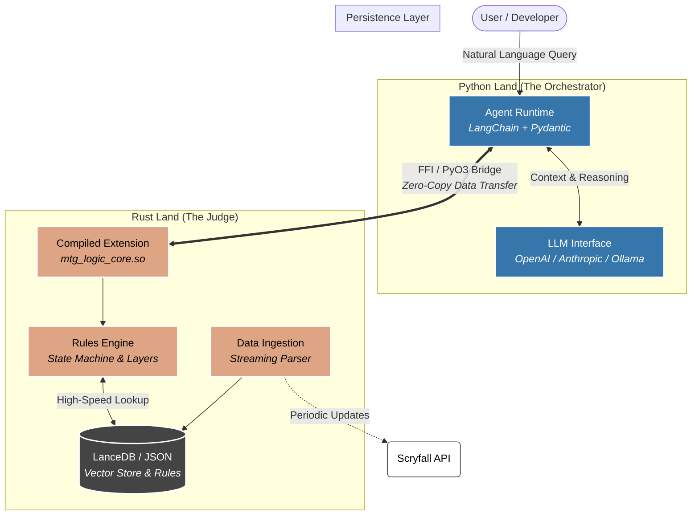

# Blind Eternities

**A Retrieval-Augmented Rules (RAG) Engine for Magic: The Gathering**

## Overview

Blind Eternities is an AI-driven, polyglot application that acts as a judge and rules assistant for Magic: The Gathering. It uses a hybrid **Python + Rust** architecture to combine the natural language reasoning capabilities of Large Language Models (LLMs) with the strict, deterministic execution of a compiled rules engine.

## Architecture

Python handles the semantic reasoning and LLM orchestration, while a compiled Rust core enforces the strict game state rules and handles high-performance vector retrieval via LanceDB.


```mermaid
    graph TD
    %% Styling Definitions
    classDef python fill:#3776ab,stroke:#fff,stroke-width:2px,color:#fff;
    classDef rust fill:#dea584,stroke:#fff,stroke-width:2px,color:#000;
    classDef data fill:#444,stroke:#fff,stroke-width:2px,color:#fff;
    classDef user fill:#fff,stroke:#333,stroke-width:1px,color:#000;

    user([User / Developer]) -->|Natural Language Query| Agent

    subgraph "Python Land (The Orchestrator)"
        Agent[Agent Runtime<br/><i>LangChain + Pydantic</i>]:::python
        LLM[LLM Interface<br/><i>OpenAI / Anthropic / Ollama</i>]:::python
        Agent <-->|Context & Reasoning| LLM
    end

    Agent <==>|FFI / PyO3 Bridge<br/><i>Zero-Copy Data Transfer</i>| Core

    subgraph "Rust Land (The Judge)"
        Core[Compiled Extension<br/><i>mtg_logic_core.so</i>]:::rust
        Rules[Rules Engine<br/><i>State Machine & Layers</i>]:::rust
        Ingest[Data Ingestion<br/><i>Streaming Parser</i>]:::rust

        Core --> Rules
        Ingest --> DB
    end

    subgraph "Persistence Layer"
        DB[(LanceDB / JSON<br/><i>Vector Store & Rules</i>)]:::data
        Rules <-->|High-Speed Lookup| DB
    end

    %% Legend / Connectors
    Ingest -.->|Periodic Updates| Scryfall(Scryfall API):::user
```

## Setup & Installation

1. **Environment Variables**: Create a `.env` file in the root directory (you can copy `.env.example`).
2. **Compile the Rust Bridge**: The Rust engine must be compiled into a Python extension module.
   ```bash
   task compile
   ```
3. **Verify Installation**: Test that the FFI bridge is working correctly.
   ```bash
   python -c "import mtg_logic_core; print(f'Bridge Operational: {mtg_logic_core.__name__}')"
   ```

## Usage Instructions

This project includes Go-Task (`task`) to run standard operations easily.

### Interactive AI Agent
Run the command-line LLM interface (ensure your local Ollama or configured LLM provider is running):
```bash
task agent
```

*Example Prompt:*
> "I have an Urza, Lord High Artificer on the battlefield. I cast a second Urza, Lord High Artificer. What happens?"

### Streamlit UI (The Judge Interface)
Run the web dashboard to visually inspect game states and manipulate the battlefield:
```bash
task ui
```

### Testing
Run both the Python FFI integration tests and the internal Rust core tests:
```bash
task test
```

### Code Quality (Linting & Formatting)
```bash
task lint
task fmt
```

## Disclaimer

Unofficial Fan Content Policy: This project is unofficial Fan Content permitted under the Fan Content Policy. Not approved/endorsed by Wizards. Portions of the materials used are property of Wizards of the Coast. ©Wizards of the Coast LLC.
